<!-- ═══════════════════════════ HEADER ═══════════════════════════ -->

<picture>
  <source media="(prefers-color-scheme: dark)" srcset="https://readme-typing-svg.demolab.com?font=Fira+Code&weight=500&size=20&duration=3200&pause=1000&color=6EE7F7&center=true&vCenter=true&width=600&height=45&lines=Full+Stack+Developer;React+%C2%B7+Next.js+%C2%B7+TypeScript;Web+%26+mobile+apps+with+React+Native;From+Figma+to+production;Open+to+freelance+%26+remote+work" />
  
</picture>

**I design and build modern web & mobile apps — clean, scalable, and well-crafted from UI to API.**

 

<!-- ═══════════════════════════ ABOUT ═══════════════════════════ -->
## About me

I'm a full stack developer based in **Haiti 🇭🇹**, working remotely with clients and teams anywhere. I take products from a Figma file all the way to a deployed app — interface, API, database and auth included.

- 📍 **Based in** Haiti — remote-friendly, Eastern Time
- 💼 **Open to** freelance, full-time roles, collaborations & open source
- 🗣️ **Speaks** Kreyòl, Français & English
- 🎯 **Focus** web & mobile apps, REST APIs, auth and real-time data

🇫🇷 <b>Lire en français</b>

 

Je conçois et développe des applications web et mobile modernes, de l'interface jusqu'à l'API — propres, scalables et bien structurées. Basé en Haïti, je travaille à distance avec des clients et des équipes partout dans le monde.

**Disponible pour :** freelance · emploi · collaborations · open source

 

<!-- ═══════════════════════════ STACK ═══════════════════════════ -->
## Tech stack

  <picture>
    <source media="(prefers-color-scheme: dark)" srcset="https://skillicons.dev/icons?i=react,nextjs,ts,tailwind,redux,nodejs,express,postgres,supabase,firebase,gcp,figma,git,github,vscode,postman&perline=8&theme=dark" />
    
  </picture>

| What I build | With |
| :-- | :-- |
| 🌐 **Web apps** | React, Next.js, TypeScript, Tailwind CSS, Redux |
| 📱 **Mobile apps** | React Native & Expo — iOS and Android |
| ⚙️ **APIs & backends** | Node.js, Express, REST |
| 🔐 **Auth & data** | Firebase, Supabase, PostgreSQL — auth, real-time, storage |
| ☁️ **Cloud** | Google Cloud Platform |
| 🎨 **Design → code** | Figma to pixel-perfect UI |
| 🧰 **Workflow** | Git, GitHub, VS Code, Postman |

 

<!-- ═══════════════════════════ PROJECTS ═══════════════════════════ -->
## Featured projects

<table>
  <tr>
    <td width="50%" valign="top">

### ⚡ Zine

Details coming soon.

<!-- When it's live, replace the line above with:
     a one-line pitch · the stack · [Live demo](https://…) · [Code](https://…) -->

</td>
    <td width="50%" valign="top">

### ⚡ Zilo

Details coming soon.

<!-- When it's live, replace the line above with:
     a one-line pitch · the stack · [Live demo](https://…) · [Code](https://…) -->

</td>
  </tr>
</table>

Browse everything else on my **[portfolio →](https://rbil1y.github.io/portfolio/)**

 

<!-- ═══════════════════════════ ACTIVITY ═══════════════════════════ -->
<!-- These cards are generated daily by .github/workflows/profile-cards.yml -->
## GitHub activity

  <picture>
    <source media="(prefers-color-scheme: dark)" srcset="./profile/stats-dark.svg" />
    
  </picture>
  <picture>
    <source media="(prefers-color-scheme: dark)" srcset="./profile/streak-dark.svg" />
    
  </picture>

 

<!-- ═══════════════════════════ CONTACT ═══════════════════════════ -->
## Let's work together

Have a project in mind or a role to fill? I'd love to hear about it.

📧 **Email** — [Rbillyexume@gmail.com](mailto:Rbillyexume@gmail.com) 
🌐 **Portfolio** — [rbil1y.github.io/portfolio](https://rbil1y.github.io/portfolio/)

 

*Code with purpose. Build with passion. Ship with pride.*

